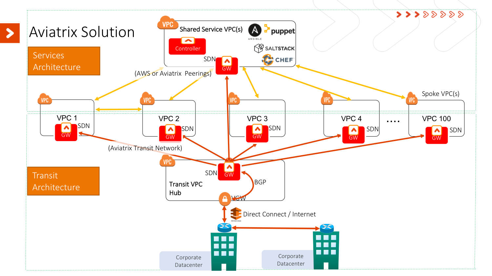

<!-- This section displays Aviatrix Logo, and it's currently "commented-out"
<p align="center">
  
</p>


<br><br>
-->


PROJECT: Aviatrix Transit Network API with Python:
==================================================

This Python project demonstrates using Aviatrix REST API to build Transit Network solution.

<br>




<br><br>


References:
==================================================

* [Project Documentation](https://aviatrix-systems-inc-docs.readthedocs-hosted.com/HowTos/transit-network-api-with-python/doc.html)

* [Aviatrix Transit Network Documentation](http://docs.aviatrix.com/HowTos/transitvpc_workflow.html)

* [Aviatrix API Documentation](https://s3-us-west-2.amazonaws.com/avx-apidoc/index.htm)

* [Tools to Execute Aviatrix API](http://docs.aviatrix.com/HowTos/AviatrixAPI/multiple_approaches_to_use_aviatrix_api/multiple_approaches_to_use_aviatrix_api.html)

* [Aviatrix Official Website](https://www.aviatrix.com)


<br><br>


Prerequisites
==================================================

* [AWS](https://aws.amazon.com/)
    - Need to have at least 3 [VPCs](https://aws.amazon.com/vpc/) (1 for Transit VPC and 2 for Spoke VPCs) and 1 VGW available.

* Aviatrix
    - [Aviatrix Cloud Controller](http://docs.aviatrix.com/StartUpGuides/aws_manual_startup_guide.html) with [version 3.1 or later](http://docs.aviatrix.com/HowTos/UCC_Release_Notes.html)
    - [Aviatrix Customer ID](http://docs.aviatrix.com/HowTos/onboarding_faq.html) (ONLY if controller image is "BYOL")
    - [Controller Cloud-Account](http://docs.aviatrix.com/StartUpGuides/aviatrix-cloud-controller-startup-guide.html)

* [Python](https://www.python.org/) 3 packages/libraries

```
$ pip install requests
```

* MUST complete the script configuration file "config/config.json". The example can be found in the file "config/example-config.json".


<br><br>


Run Scripts
==================================================
* To Build Transit Network
```
$ python build_transit_network.py
```

* To Tear down Transit Network
```
$ python teardown_transit_network.py
```


<br><br>


More INFO:
==================================================

* To finish building the topology, it takes roughly 15-30 min (with 2 Spoke Gateways) depending on the regions of your resources.


* What might be new on next version of the script:
      - Connect On-Prem VPC
      - Connect Share-Service-VPC
      - Connect Exgress VPC


<br><br>


FAQ:
==================================================

* Q: How to modify "config.json" to create more Spoke gateways in different VPCs?
  + Ans: In "config.json" file, the "value" of the "key", "spoke_gateways" is a list/array of json objects. Each object/element represents a Spoke VPC/Gateway. Since we already have 2 elements in the list, we just need to append a new element at the end of the array.


* Q: What does "ha_enabled" in "config.json" do?
  + Ans: By default, the value is "yes". If the value of "ha_enabled" is "yes", that means the script will have HA for connections between Transit/Spoke Gateways and VGW.


* Q: What does "pause_on_every_step" in "config.json" do?
  + Ans: By default, the value is "no". Which means the script won't be paused/interrupted (assume there is no error occurs) until the script finishes. 
  If the value is "yes", and user needs to enter any key to proceed the script right after each Aviatrix REST API is completed. You're using this feature ONLY because you wish check the result of each API execution.


<br><br>


Author:
==================================================

Ryan Liu - _Aviatrix Systems Inc_


<br><br>


